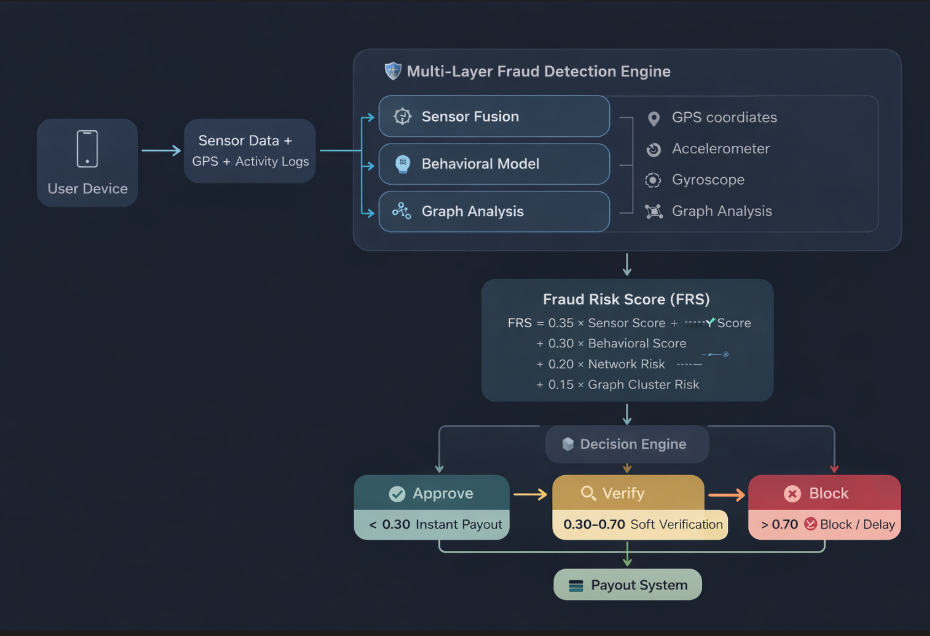

# 🛡️ Our Solution: Multi-Layer Adversarial Defense System

We introduce a 4-layer intelligent defense architecture combining sensor fusion, behavioral intelligence, graph analysis, and dynamic risk control.

---

## ⚙️ 1. Multi-Layer Fraud Detection Engine

**🔹 A. Sensor Fusion Validation (Reality Check Layer)**

We do not trust GPS alone.

We cross-verify:

- 📍 GPS coordinates
- 📱 Accelerometer (movement detection)
- 🔄 Gyroscope (orientation changes)

✅ Detects:

- Teleportation Fraud → Unrealistic speed jumps (e.g., 5 km in 2 seconds)
- Static Spoofing → GPS moving but device physically stationary

👉 If GPS ≠ Physical Motion → High Risk Flag

---

**🔹 B. Behavioral Anomaly Detection (User Intelligence Layer)**

Each user has a behavioral fingerprint.

We analyze:

- Claim frequency patterns
- Time-of-day activity
- Historical delivery consistency

✅ Detects:

- Sudden spike in claims
- Claims at unusual hours
- Behavior deviation from baseline

👉 Uses statistical variance to compute anomaly score

---

**🔹 C. Graph-Based Fraud Ring Detection (Network Intelligence Layer)**

Fraud is rarely individual — it’s coordinated.

We construct a dynamic graph network:

- Nodes → Users
- Edges → Shared attributes:
  - IP address
  - Device ID
  - Claim timing similarity

Using:

- "graphology"
- "Louvain Community Detection"

✅ Detects:

- Fraud clusters
- Synchronized claim bursts
- Hidden syndicates

👉 Users in suspicious clusters → Network Risk Boost

---

## 🧮 2. Fraud Risk Scoring Engine (FRS)

We combine all signals into a single interpretable score (0–1):

FRS = 
0.35 × Sensor Score +
0.30 × Behavioral Score +
0.20 × Network Risk +
0.15 × Graph Cluster Risk

---

🚦 Decision Engine:

FRS Score| Action
< 0.30| ✅ Instant Payout
0.30–0.70| ⚠️ Soft Verification
> 0.70| ❌ Block / Delay

---

## ⚖️ 3. Fair UX for Honest Users

We ensure zero friction for genuine workers:

**🔹 Smart Handling:**

- No immediate rejection
- Introduce progressive verification:
  - OTP confirmation
  - Selfie validation
  - Delivery proof

👉 Honest users are protected, not punished

---

## 💰 4. Liquidity Pool Protection System

To prevent system-wide collapse, we introduce:

🚨 Attack Detection Trigger:

- Sudden spike in high-risk claims
- Clustered fraud activity

🧠 Adaptive Defense:

- Increase fraud threshold dynamically
- Delay payouts for high-risk clusters
- Prioritize low-risk genuine users

👉 Ensures financial sustainability under attack

---

## 🔐 5. Anti-Spoofing Enhancements

We go beyond traditional detection:

- Detect mock location apps
- Compare GPS vs network triangulation
- Track device fingerprint consistency
- Identify multi-account abuse
- Detect identical movement patterns across users

---

## 🏗️ System Architecture

User Device
   ↓
Sensor Data + GPS + Activity Logs
   ↓
Fraud Detection Engine
   ├── Sensor Fusion
   ├── Behavioral Model
   ├── Graph Analysis
   ↓
Fraud Risk Score (FRS)
   ↓
Decision Engine
   ├── Approve
   ├── Verify
   └── Block
   ↓
Payout System

---

## 🧪 Simulation & Testing

🔐 Admin Access:

Email: admin@insurance.com
Password: password

---

🎮 Features:

- ✅ Simulate normal claims
- ⚠️ Simulate spoofed GPS attack
- 🚨 Trigger coordinated fraud event
- 📊 Monitor:
  - Fraud score distribution
  - Liquidity pool health
  - Active fraud clusters

---

## 🚀 Tech Stack

**Layer| Technology
Frontend| React, Tailwind, Framer Motion
Backend| Node.js, Express, TypeScript
Database| SQLite (better-sqlite3)
Graph Analysis| graphology, louvain
Visualization| Recharts**

---

## 🏆 Key Innovations

✔ Multi-signal validation (not GPS-dependent)
✔ Real-time fraud ring detection
✔ Adaptive liquidity protection
✔ AI-driven risk scoring
✔ Human-friendly verification system

---

## 🎯 Final Outcome

Our system is not just fraud-resistant — it is fraud-adaptive.

«“As attackers evolve, our system learns, adapts, and defends in real-time.”»

---

🚀 Why This Wins

- Solves real attack scenario (24hr challenge)
- Goes beyond basic validation
- Combines AI + Graph + System Design
- Balances security + user experience
- Demonstrates production-level thinking
